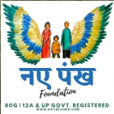
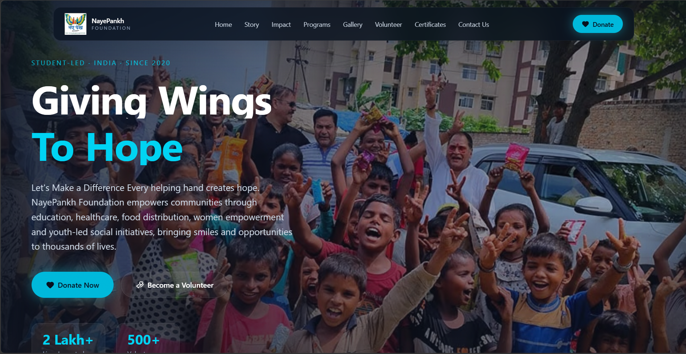

# 🌸 NayePankh Foundation

<p align="center">
  
</p>

<h1 align="center">NayePankh</h1>

<p align="center">
<b>Giving Wings To Hope</b>
</p>

<p align="center">
A modern, responsive and visually engaging NGO website built with Next.js, TypeScript, Tailwind CSS and Framer Motion.
</p>

---

## 🌐 Live Website

🔗 **https://naye-pankh-foundation-phi.vercel.app**

---

## 📸 Website Preview

<p align="center">
  
</p>

---

## ✨ Features

- Responsive Design (Desktop, Tablet & Mobile)
- Cinematic Hero Section
- About Us & Story Timeline
- Impact Statistics
- NGO Programs & Social Initiatives
- Donation Section
- Interactive Gallery
- NGO Certifications
- Volunteer / Join Us Section
- Contact Section
- Smooth Framer Motion Animations
- Fully Deployed on Vercel

---

## 🛠 Tech Stack

| Technology | Usage |
|------------|-------|
| Next.js 15 | Framework |
| TypeScript | Type Safety |
| Tailwind CSS | Styling |
| Framer Motion | Animations |
| Lucide React | Icons |
| Shadcn UI | UI Components |
| Vercel | Deployment |

---

## 🚀 Installation

Clone the repository

```bash
git clone https://github.com/YOUR_USERNAME/naye-pankh-foundation.git
```

Move to the project

```bash
cd naye-pankh-foundation
```

Install dependencies

```bash
npm install
```

Start development server

```bash
npm run dev
```

Open:

```text
http://localhost:3000
```

---

## 📁 Project Structure

```text
app/
├── layout.tsx
├── page.tsx
├── globals.css

components/
├── Navbar.tsx
├── Hero.tsx
├── AboutUs.tsx
├── WhatIsNayePankh.tsx
├── Story.tsx
├── Impact.tsx
├── Programs.tsx
├── Donate.tsx
├── Gallery.tsx
├── Certificates.tsx
├── JoinUs.tsx
├── GetInTouch.tsx
└── Footer.tsx

lib/
├── constants.ts
├── motion.ts
├── seo.ts
└── utils.ts

public/
├── logo.png
├── screenshot.png
├── photo1.jpg
├── photo2.jpg
├── photo3.jpg
└── ...
```

---

## 🎨 Design Philosophy

The website is designed to create an emotional and inspiring experience that reflects the vision of NayePankh Foundation.

The focus is on:

- Human-centered storytelling
- Emotional NGO experience
- Smooth interactions
- Accessibility and responsiveness
- Trust and transparency

---

## ❤️ Mission

**Giving Wings To Hope, One Life At A Time.**

Empowering communities through education, social welfare, youth empowerment and meaningful change.

---

## 🌟 Deployment

Hosted on **Vercel**

🔗 https://naye-pankh-foundation-phi.vercel.app

---

### Made with ❤️ for NayePankh Foundation